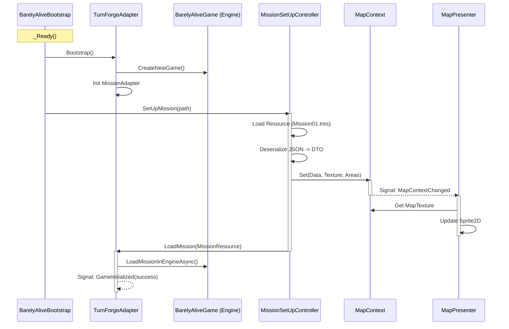

# BarelyAlive UI Technical Documentation

## Boot & Mission Load Sequence

This diagram illustrates the initialization process when the Godot application starts, specifically focusing on the `BarelyAliveBootstrap`, `MissionSetUpController`, and `TurnForgeAdapter` interactions.

### Key Components

1.  **BarelyAliveBootstrap**: Entry point. Initializes the Adapter and triggers the auto-load of the default mission.
2.  **TurnForgeAdapter**: Singleton bridge between Godot and the C# Game Engine.
3.  **MissionSetUpController**: Orchestrates the loading of a mission. It updates the UI model (`MapContext`) *before* asking the engine to load the logic, ensuring the visual static properties (Map Texture) are available immediately.
4.  **MapContext**: Holds the state of the current map (Texture, Dimensions, Areas) for the UI. Emits signals when data changes.
5.  **MapPresenter**: Passive view component that listens to `MapContext` and updates the actual Godot Nodes (Sprite2D).
