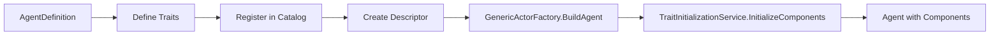
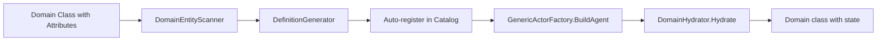

# TurnForge Backlog

**Last Updated:** 2025-12-25  
**Active Items:** 9 | **Ready:** 9 | **Pending Analysis:** 4
 | **See [BACKLOG_COMPLETED.md](BACKLOG_COMPLETED.md) for archived work.**

---

## 📖 How to Use This Backlog

### Item Types

- **EPIC** - Large initiative spanning multiple features (weeks/months)
- **FEATURE** - Specific functionality to implement (days/week)  
- **IDEA** - Concept requiring analysis before becoming a feature
- **TASK** - Concrete work item with clear deliverables (hours/days)

### Workflow

```
IDEA → Analysis → Approval → FEATURE/EPIC
FEATURE → Design → Implementation → TASK(s)
TASK → Complete → DONE
```

### Status Indicators

- 🟢 **DONE** - Completed and verified
- 🟡 **IN PROGRESS** - Currently being worked on
- 🔴 **BLOCKED** - Waiting on dependency
- ⚪ **BACKLOG** - Not started, ready to pick up
- 💡 **IDEA** - Needs analysis/decision

### Priority Levels

- **Critical** - Blocking other work, must do now
- **High** - Important for upcoming release
- **Medium** - Valuable but not urgent
- **Low** - Nice to have, future consideration

---

## 🟡 In Progress / Epics

### EPIC-001: Services System (Partial)
**Status:** 🟡 IN PROGRESS  
(See BACKLOG_COMPLETED.md for completed parts)
- Pending: Action Queries (FEATURE-011), Visibility, Pathfinding, FSM Services.

### EPIC-002: BarelyAlive E2E Validation System
**Status:** 🟡 IN PROGRESS  
(See BACKLOG_COMPLETED.md for completed parts)
- Pending: Simulator (FEATURE-008).


### EPIC-002: BarelyAlive E2E Validation System

**Status:** 🟡 IN PROGRESS (3/4 features done)  
**Priority:** High  
**Effort:** 3-4 weeks

**Vision:**  
Enable rapid E2E validation of BarelyAlive functionality without requiring Godot UI. Provide both programmatic test infrastructure and interactive console simulator for testing game flows, command sequences, and state transitions.

**Success Criteria:**
- [x] Fluent API for scenario creation in tests
- [x] JSON-based scenario serialization
- [x] Command builder for common operations
- [x] Movement API exposed through BarelyAlive
- [x] State query API exposed through BarelyAlive
- [ ] Console simulator for interactive testing
- [ ] Documentation with examples

**Related Features:**
- FEATURE-007: Test Scenario Infrastructure ✅
- FEATURE-009: Movement API ✅
- FEATURE-010: Game State Query API ✅
- FEATURE-008: Console Simulator Project

**Dependencies:**
- None (builds on existing BarelyAlive.Rules.Tests infrastructure)

---

## ⚪ Ready to Work

### High Priority

#### FEATURE-005: BoardQueryService

**Status:** ⚪ BACKLOG  
**Priority:** High  
**Effort:** 3-5 days  
**Epic:** EPIC-001 (Services)

**Description:**  
Service for board queries with game state integration (occupied positions, neighbors, etc.)

**Acceptance Criteria:**
- [ ] `GetNeighbors(Position)` - Returns valid connected neighbors
- [ ] `Distance(Position, Position)` - Calculates shortest path distance
- [ ] `IsOccupied(Position)` - Checks if agents at position
- [ ] `GetReachable(Agent, int range)` - All positions within move range
- [ ] Unit tests for all methods

**Technical Notes:**
- Delegates to ISpatialModel for base queries
- Adds GameState awareness (agents, blockers)
- Used by movement strategies

**Dependencies:**
- ISpatialModel implementation
- GameStateQueryService (for agent queries)

---


#### FEATURE-008: Console Simulator Project

**Status:** ⚪ BACKLOG  
**Priority:** High  
**Effort:** 3-5 days  
**Epic:** EPIC-002 (E2E Validation)

**Description:**  
Interactive console application for manual E2E testing and debugging. Provides REPL interface and script execution mode.

**Acceptance Criteria:**
- [ ] New project: `src/BarelyAlive.Simulator/`
- [ ] Interactive REPL mode (type commands)
- [ ] Script execution mode (run JSON scenarios)
- [ ] ASCII board visualization (optional)
- [ ] Detailed effect/event logging
- [ ] Command history and replay
- [ ] README with usage examples

**Technical Notes:**
- Console application (.NET 8)
- References `BarelyAlive.Rules`
- Uses `BarelyAliveGame` API (same as Godot adapter)
- Reuses FEATURE-007 infrastructure internally

**Example Usage:**
```bash
# Interactive mode
$ simulator interactive
> load mission01.json
> spawn Mike Doug
> move Mike B2
> attack Mike Zombie1

# Script mode
$ simulator run scenarios/test_combat.json
```

**Dependencies:**
- FEATURE-007 (reuses ScenarioRunner/CommandBuilder)

---


#### FEATURE-011: Action Query Service (GetValidMoveDestinations)

**Status:** ⚪ BACKLOG  
**Priority:** High  
**Effort:** 2-3 days  
**Epic:** EPIC-001 (Services)

**Description:**  
Enable UI to query valid move destinations for an agent without executing commands. Supports UI features like highlighting available tiles on agent selection.

**Acceptance Criteria:**
- [ ] `GetValidMoveDestinations(agentId)` method in `IGameStateQuery`
- [ ] Implementation in `GameStateQueryService` with board dependency
- [ ] Basic validation logic (AP, board bounds, neighbors)
- [ ] Unit tests for query service
- [ ] Integration tests with real board scenarios
- [ ] Documentation in implementation plan

**Technical Notes:**
- **Approach:** Option C - Extend existing `GameStateQueryService`
- Constructor needs `GameBoard` injected for neighbor queries
- Validation is **simplified** (doesn't replicate full strategy logic)
- Good enough for 80% of UI preview use cases
- Easily extensible for future action types (attack, etc.)

**API Design:**
```csharp
public interface IGameStateQuery
{
    // Existing...
    Agent? GetAgent(string agentId);
    
    // NEW
    IReadOnlyList<Position> GetValidMoveDestinations(string agentId);
}
```

**Future Extensibility:**
- Phase 2: `GetValidAttackTargets(agentId)`
- Phase 3: Optional `IActionStrategy.Validate()` for 100% accurate validation

**Dependencies:**
- GameBoard (for neighbor queries)
- IActionPointsComponent (for AP checks)

---

#### FEATURE-012: DiceThrow Service

**Status:** 🟢 DONE (2025-12-26)  
**Priority:** High  
**Effort:** 3-5 days  
**Epic:** EPIC-001 (Services)

**Description:**  
Create a robust dice rolling service supporting standard RPG dice notation with modifiers (keep highest/lowest, reroll) and pass/fail checks. Provides deterministic random number generation for skill checks, damage rolls, and action validation.

**Namespace:** `TurnForge.Engine.Services.Dice`

**Acceptance Criteria:**
- [ ] `DiceThrowType` value object representing dice notation (e.g., "1D20", "2D6+3", "3D6kh2")
- [ ] `DiceThrowLimit` value object for pass threshold (e.g., "10+" means ≥10)
- [ ] Parse dice notation strings into structured format (including modifiers)
- [ ] Execute rolls: `Roll(DiceThrowType)`, `Roll(DiceThrowType, DiceThrowLimit)` returning result
- [ ] `DiceRollResult` with:
  - `Total` - Final sum including modifier
  - `FinalRolls[]` - Dice kept after modifiers applied
  - `History[]` - Complete roll history (optional, controlled by `trackHistory` flag)
  - `Pass` - `bool?` (null if no limit, true/false if limit provided)
- [ ] Fluent comparison API: `Roll("1D6").IsHigherOrEqualThan(3)` returns bool
- [ ] Support for:
  - Single/multiple dice: `1D20`, `3D6`
  - Arithmetic modifiers: `1D6+2`, `2D4-1`
  - Keep highest: `3D6kh2` or fluent `.KeepHighest(2)`
  - Keep lowest: `3D6kl2` or fluent `.KeepLowest(2)`
  - Reroll threshold: `2D6r1` (reroll 1s) or fluent `.Reroll(1, maxTimes: 1)`
- [ ] Deterministic seeding for tests (inject `Random` or seed)
- [ ] Unit tests with mocked randomness
- [ ] Documentation with dice notation grammar

**API Design:**
```csharp
// ========== VALUE OBJECTS ==========

public record DiceThrowType
{
    public int DiceCount { get; init; }           // 3 in "3D6"
    public int DiceSides { get; init; }           // 6 in "3D6"
    public int Modifier { get; init; }            // +2 in "3D6+2"
    public IReadOnlyList<IDiceModifier> Modifiers { get; init; } = [];
    
    public static DiceThrowType Parse(string notation);  // "3D6kh2+5"
    
    // Fluent builders
    public DiceThrowType KeepHighest(int count);
    public DiceThrowType KeepLowest(int count);
    public DiceThrowType Reroll(int threshold, int maxTimes = 1);
}

public record DiceThrowLimit
{
    public int Threshold { get; init; }           // 10 in "10+"
    public static DiceThrowLimit Parse(string notation);  // "10+"
    public bool IsPassed(int total) => total >= Threshold;
}

// ========== MODIFIER INTERFACE ==========

public interface IDiceModifier
{
    ModifierResult Apply(IReadOnlyList<int> rolls, Random random);
}

public record ModifierResult(
    IReadOnlyList<int> FinalRolls,
    IReadOnlyList<RollHistoryEntry> History
);

public record RollHistoryEntry(
    int OriginalValue,
    int? RerolledTo,        // null if kept as-is
    string Reason           // "KeepHighest", "Reroll ≤1", "Dropped"
);

// Built-in modifiers
public record KeepHighestModifier(int Count) : IDiceModifier;
public record KeepLowestModifier(int Count) : IDiceModifier;
public record RerollModifier(int Threshold, int MaxTimes = 1) : IDiceModifier;

// ========== SERVICE ==========

public interface IDiceThrowService
{
    DiceRollResult Roll(DiceThrowType diceThrow, bool trackHistory = false);
    DiceRollResult Roll(string notation, bool trackHistory = false);
    DiceRollResult Roll(DiceThrowType diceThrow, DiceThrowLimit limit, bool trackHistory = false);
    DiceRollResult Roll(string diceNotation, string limitNotation, bool trackHistory = false);
}

// ========== RESULT ==========

public record DiceRollResult
{
    public int Total { get; init; }
    public IReadOnlyList<int> FinalRolls { get; init; }
    public IReadOnlyList<RollHistoryEntry>? History { get; init; }  // null if trackHistory=false
    public DiceThrowType DiceThrow { get; init; }
    public DiceThrowLimit? Limit { get; init; }
    public bool? Pass => Limit?.IsPassed(Total);  // null if no limit
    
    // Fluent comparisons
    public bool IsHigherOrEqualThan(int threshold) => Total >= threshold;
    public bool IsLowerThan(int threshold) => Total < threshold;
    public bool IsExactly(int value) => Total == value;
}
```

**Example Usage:**
```csharp
// Setup (deterministic for tests)
var service = new DiceThrowService(new Random(42));

// Simple roll
var damage = service.Roll("2D6+3");
Console.WriteLine($"Damage: {damage.Total}");

// Advantage (2D20 keep highest)
var advantage = DiceThrowType.Parse("2D20").KeepHighest(1);
var attackRoll = service.Roll(advantage);

// Or via notation
var attackRoll2 = service.Roll("2D20kh1");

// With pass/fail check
var dangerCheck = service.Roll("1D6", "4+");
if (dangerCheck.Pass == true) { /* Safe */ }

// Reroll ones, with history
var rerollOnes = DiceThrowType.Parse("3D6").Reroll(1);
var r = service.Roll(rerollOnes, trackHistory: true);
// r.History: [{ Original: 1, RerolledTo: 4, Reason: "Reroll ≤1" }, ...]
```

**Grammar (Dice Notation):**
```
<dice>     ::= <count>D<sides>[<keep>][<reroll>][<modifier>]
<count>    ::= positive integer (default 1)
<sides>    ::= positive integer
<keep>     ::= 'kh'<n> | 'kl'<n>    // keep highest/lowest n dice
<reroll>   ::= 'r'<n>               // reroll dice ≤n (once)
<modifier> ::= [+|-]<value>

<limit>    ::= <threshold>'+'       // e.g., "10+"
```

**File Structure:**
```
src/TurnForge.Engine/Services/Dice/
├── IDiceThrowService.cs
├── DiceThrowService.cs
├── ValueObjects/
│   ├── DiceThrowType.cs
│   ├── DiceThrowLimit.cs
│   └── DiceRollResult.cs
├── Modifiers/
│   ├── IDiceModifier.cs
│   ├── KeepHighestModifier.cs
│   ├── KeepLowestModifier.cs
│   └── RerollModifier.cs
└── Parsing/
    └── DiceNotationParser.cs
```

**Related Features:**
- IDEA-004: Conditional Actions with Dice Roll Validation (primary consumer)
- FEATURE-006: Dynamic Stats Component (stat-based check modifiers)
- IDEA-009: Custom Dice Modifiers (future extensibility)
- IDEA-010: Extensible Dice Parser (future extensibility)

**Dependencies:**
- None (core service, no game logic dependencies)

---

#### FEATURE-004: Handler/Applier Autodiscovery

**Status:** ⚪ BACKLOG  
**Priority:** High  
**Effort:** 5-7 days

**Description:**  
Reduce boilerplate by auto-discovering and registering handlers, services, and appliers via reflection/attributes.

**Acceptance Criteria:**
- [ ] `[AutoRegister]` attribute for handlers
- [ ] Assembly scanning on startup
- [ ] Auto-registration in DI container
- [ ] Works for: ICommandHandler, IApplier, IService
- [ ] Configuration to enable/disable per assembly

**Technical Notes:**
- Use reflection to scan assemblies
- Respect `[DoNotAutoRegister]` opt-out
- Performance: cache registrations

**Dependencies:**
- None (engine improvement)

---

### Medium Priority

#### FEATURE-002: Specialized Engine Props

**Status:** ⚪ BACKLOG  
**Priority:** Medium  
**Effort:** 3-4 days

**Description:**  
Built-in prop types provided by engine for common use cases.

**Proposed Types:**
- `SpawnPoint` - Agent spawn location with metadata
- `Objective` - Mission objective marker
- `Trigger` - Event trigger zone
- `Blocker` - Movement blocking obstacle

**Acceptance Criteria:**
- [ ] Base classes created in TurnForge.Engine
- [ ] Each type has descriptor + definition
- [ ] Documented in /docs/2-using/entities.md
- [ ] Example usage in BarelyAlive.Rules

**Technical Notes:**
- Extend Prop base class
- Add specialized components as needed
- Keep engine-agnostic (no game logic)

---

#### FEATURE-003: Specialized Engine Descriptors

**Status:** ⚪ BACKLOG  
**Priority:** Medium  
**Effort:** 2-3 days

**Description:**  
Convenience descriptors for common patterns.

**Proposed Types:**
- `PositionedDescriptor<T>` - Auto-includes Position
- `HealthDescriptor<T>` - Auto-includes Health
- `CombatDescriptor<T>` - Health + damage stats

**Acceptance Criteria:**
- [ ] Base descriptor classes created
- [ ] PropertyAutoMapper supports inheritance
- [ ] Documented with examples
- [ ] Used in at least one game project

**Technical Notes:**
- Generic base classes
- Composable (descriptor can extend multiple via interfaces)

**Dependencies:**
- PropertyAutoMapper must handle descriptor inheritance

---


## 💡 Ideas / Analysis Needed

### IDEA-001: Effects As Behaviours

**Status:** 💡 NEEDS ANALYSIS  
**Proposed By:** Initial design discussion

**Problem / Opportunity:**  
Current effects are fire-and-forget. Need temporal effects (poison, buffs, debuffs) that persist across turns.

**Proposal:**  
Effects = IBehaviour + IApplier?

Temporal effects could:
- Apply at specific turn phases
- Stack or override
- Have duration/expiry

**Questions to Answer:**
- [ ] How do temporal effects differ from current IGameEffect?
- [ ] Should they be Decisions with DecisionTiming?
- [ ] Do we need a separate EffectComponent?
- [ ] How does UI represent ongoing effects?

**Next Steps:**
- [ ] Spike: prototype temporal effect with existing system
- [ ] Design doc: proposed new architecture if needed
- [ ] Decision: extend existing vs new system

---

### IDEA-003: Strongly-Typed Decisions

**Status:** 💡 PARTIALLY IMPLEMENTED  
**Proposed By:** Architecture refinement

**Problem / Opportunity:**  
More specific decision types enable type-safe appliers and better validation.

**Current State:**
- ✅ `ActionDecision` - Component updates (implemented)
- ✅ `SpawnDecision<T>` - Entity spawning (implemented)

**Proposal:**  
Add more typed decisions:
- `MovementDecision` - Movement-specific with path info
- `DamageDecision` - Damage calculation results
- `BehaviourUpdateDecision` - Add/remove behaviours
- `EffectDecision` - Apply temporal effects

**Benefits:**
- ✅ Type-safe applier routing
- ✅ Stricter validation per decision type
- ✅ Clearer intent in code

**Questions to Answer:**
- [ ] Do we need these beyond ActionDecision's flexibility?
- [ ] Would this complicate the architecture?
- [ ] Real-world use cases that can't use ActionDecision?

**Next Steps:**
- [ ] Analyze current ActionDecision usage
- [ ] Identify pain points
- [ ] Decide: extend ActionDecision vs new types

---

### IDEA-004: Conditional Actions with Dice Roll Validation

**Status:** 💡 NEEDS ANALYSIS  
**Proposed By:** Xavier Barrufet, 2025-12-25

**Problem / Opportunity:**  
Many tactical games require actions to be validated through skill checks or dice rolls before execution. Example: moving through a "DANGEROUS" area requires passing a die roll to avoid triggering effects (damage, spawn, etc.).

**Current Gap:**  
The engine can validate action legality (AP cost, range, blockers) but has no mechanism for:
- Conditional validation based on random checks
- Area behaviors that trigger validation requirements
- Roll-based success/failure affecting action completion

**Use Cases:**
- **Dangerous Terrain:** Moving through hazardous tiles requires a die roll to avoid damage/effects
- **Skill Checks:** Actions requiring attribute checks (e.g., "Climb" requires STR check)
- **Detection Rolls:** Stealth movement triggering enemy awareness checks
- **Environmental Hazards:** Traversing traps, swimming, climbing, etc.

**Proposal:**  
Extend the action validation pipeline to support:

1. **Area Behaviors on Tiles/Zones**  
   - `DangerousBehavior`, `DifficultTerrainBehavior`, etc.
   - Attached to board positions or props
   - Define validation requirements (dice formula, difficulty)

2. **Action Validation with Dice Resolution**  
   - Strategy checks if action triggers conditional validation
   - Generate `ValidationDecision` requiring dice roll
   - Wait for resolution before completing action
   - Apply consequences on failure (damage, AP loss, action cancel)

3. **Flow Example:**
   ```
   Player: MoveCommand(agent, dangerousTile)
   → Strategy detects DangerousBehavior on tile
   → Emit ValidationRequiredDecision(rollFormula: "1D6", difficulty: 4)
   → UI presents roll to player (or AI auto-rolls)
   → Player rolls → Effect: ValidationResultEvent(success: true/false)
   → Strategy completes or cancels move based on result
   ```

**Questions to Answer:**
- [ ] Should validation be part of IActionStrategy or a separate validation layer?
- [ ] How to handle UI interaction for player-controlled rolls vs AI auto-resolution?
- [ ] Should failed rolls prevent action entirely or apply partial effects?
- [ ] Do we need persistent "area behavior" components on board positions?
- [ ] How to integrate with existing Behavior system (IBehavior)?
- [ ] Should this extend AttributeComponent (FEATURE-006) for stat-based checks?
- [ ] What's the relationship with Effects (IDEA-001)?

**Related Concepts:**
- FEATURE-006: Dynamic Stats Component (for attribute checks)
- IDEA-001: Effects As Behaviours (temporal hazard effects)
- Board system (area behaviors, tile properties)
- Dice resolution system (needs design)

**Next Steps:**
- [ ] Research similar implementations in tactical games
- [ ] Design area behavior component architecture
- [ ] Prototype validation flow with simple dangerous terrain
- [ ] Define dice resolution protocol (command/event flow)
- [ ] Create design document with proposed architecture
- [ ] Get user approval before promoting to FEATURE

---

### IDEA-007: Domain-Driven Entity System (DDES)

**Status:** 💡 NEEDS ANALYSIS  
**Proposed By:** Xavier Barrufet, 2025-12-27

**Problem / Opportunity:**  
TurnForge currently requires developers to create separate Definition, Descriptor, and Entity classes plus configure Traits manually. This leads to boilerplate and fragmented entity configuration. A Domain-Driven approach would allow defining entities as single decorated C# classes.

**Vision:**  
Allow developers to define entities using standard C# classes with attributes. The system would automatically derive Definitions, Traits, and Components from these classes at startup.

```csharp
// BEFORE: Multiple files and classes
// SurvivorDefinition.cs + Survivor.cs + SurvivorDescriptor.cs + Traits configuration

// AFTER: Single decorated domain class
[EntityType(Category = "Survivor")]
public class Survivor : Agent 
{
    [Trait(typeof(VitalityTrait))]
    public int MaxHealth { get; set; }

    [Trait] // Convention: finds AdrenalineTrait automatically
    public int Adrenaline { get; set; }
}
```

---

#### Proposed Components

| Component | Purpose |
|-----------|---------|
| `[EntityType]` | Marks class as managed entity, sets Category |
| `[Trait]` | Maps property to Trait type (explicit or by convention) |
| `DomainEntityScanner` | Scans assemblies for decorated classes |
| `DefinitionGenerator` | Creates Definitions from domain classes |
| `IDomainHydrator` | Syncs Components ↔ Domain class properties |
| `DomainProjector` | Projects GameState entities to domain instances |

---

#### Analysis Against Current Codebase

**Current Entity Creation Flow:**



**Proposed DDES Flow:**



---

#### Integration Points (Current State 2025-12-27)

| Component | Status | Integration Notes |
|-----------|--------|-------------------|
| `EntityTypeRegistry` | ✅ Exists | Already scans for `[DefinitionType]`, can extend for `[EntityType]` |
| `TraitInitializationService` | ✅ Exists | Creates Components from Traits, DDES reuses this |
| `GenericActorFactory` | ✅ Exists | Needs extension to support domain hydration |
| `IGameCatalog` | ✅ Exists | Auto-generated Definitions go here |
| `BaseGameEntityDefinition` | ✅ Exists | Generated Definitions extend this |
| Convention-based Trait lookup | ❌ New | Must implement name→Type resolution |
| `IDomainHydrator` | ❌ New | Component↔Property synchronization |
| `DomainProjector` | ❌ New | GameState→Domain projection |

---

#### Key Challenges

1. **Immutability vs Mutability**
   - GameState is immutable (copy-on-write)
   - Domain classes have mutable properties
   - Hydrator must create new instances on state change

2. **Performance**
   - Reflection at startup is acceptable (one-time)
   - Runtime hydration needs cached delegates, not reflection
   - Consider source generators for hot paths

3. **Type Resolution**
   - Convention: `Adrenaline` → `AdrenalineTrait` (add "Trait" suffix)
   - What if trait name doesn't match? Explicit `[Trait(typeof(X))]`
   - Handle missing traits gracefully

4. **Bidirectional Sync**
   - Read: Component→Property (hydration, easy)
   - Write: Property→Component (mutation, harder)
   - Write path needs Decision generation

5. **Strategy Integration**
   - Strategies receive `Agent`/`Prop`
   - How to access domain class (`Survivor`) from strategy?
   - Projection layer needed

---

#### Proposed Attributes

```csharp
/// <summary>
/// Marks a class as a domain entity managed by TurnForge.
/// </summary>
[AttributeUsage(AttributeTargets.Class)]
public class EntityTypeAttribute : Attribute
{
    public string Category { get; set; } = "Common";
    public string DefinitionId { get; set; } = "";  // Auto-generated if empty
}

/// <summary>
/// Maps a property to a Trait type.
/// </summary>
[AttributeUsage(AttributeTargets.Property)]
public class TraitAttribute : Attribute
{
    public Type? TraitType { get; }  // Null = convention-based
    
    public TraitAttribute() { }
    public TraitAttribute(Type traitType) => TraitType = traitType;
}
```

---

#### Questions to Answer

- [ ] Should domain classes inherit from `Agent`/`Prop` or be POCOs?
- [ ] How to handle complex Traits with multiple properties?
- [ ] Should write-back (Property→Component) be automatic or explicit?
- [ ] What happens when domain class and Definition disagree?
- [ ] How to integrate with serialization (JSON missions)?
- [ ] Should hydration be on-demand or eager?
- [ ] Impact on testing: easier or harder to mock?
- [ ] Relationship with FEATURE-014 (Entity Simplification)?

---

#### Dependencies

- FEATURE-014: Entity Hierarchy Simplification (complementary)
- TraitInitializationService (reuse for trait discovery)
- EntityTypeRegistry (extend for domain scanning)

---

#### Estimated Effort

| Phase | Effort |
|-------|--------|
| Attribute design | 0.5 days |
| DomainEntityScanner | 1 day |
| DefinitionGenerator | 1.5 days |
| IDomainHydrator (read) | 1 day |
| Strategy integration | 1 day |
| Performance optimization | 1-2 days |
| **Total** | **6-7 days** |

---

#### Next Steps

- [ ] Prototype `[EntityType]` scanning in a test
- [ ] Design IDomainHydrator interface
- [ ] Evaluate source generators for performance
- [ ] Create detailed design document
- [ ] Get user approval before promoting to FEATURE

---

#### User Experience: User vs System Responsibilities

##### 1. ENTITY CREATION

**👤 User Does:**
```csharp
// Define ONE class with attributes
[EntityType(Category = "Survivor")]
public class Survivor : Agent 
{
    [Trait(typeof(VitalityTrait))]
    public int MaxHealth { get; set; } = 10;
    
    [Trait] // Convention: finds AdrenalineTrait
    public int Adrenaline { get; set; } = 0;
    
    [Trait(typeof(ActionPointsTrait))]
    public int MaxAP { get; set; } = 3;
    
    public Survivor(EntityId id, string defId, string name, string cat) 
        : base(id, defId, name, cat) { }
}
```

**User does NOT need to:**
- ❌ Create `SurvivorDefinition`
- ❌ Create `SurvivorDescriptor`
- ❌ Register manually in catalog
- ❌ Configure Traits in Definition

**🤖 System Does (Startup):**
1. **Scan** - Find classes with `[EntityType]`
2. **Generate** - Create `BaseGameEntityDefinition` with Traits from properties
3. **Register** - Auto-add to `IGameCatalog`
4. **Map** - Register in `EntityTypeRegistry` for factory

---

##### 2. SPAWNING

**👤 User Does:**
```csharp
// Basic spawn (uses class defaults)
var spawn = new SpawnRequest("Survivor");

// Spawn with overrides
var spawn = new SpawnRequest("Survivor")
{
    RequestedTraits = [
        new VitalityTrait(15),        // Override MaxHealth
        new PositionTrait(spawnPoint) // Initial position
    ]
};

engine.ExecuteCommand(new SpawnEntitiesCommand([spawn]));
```

**🤖 System Does (Runtime):**
1. **Preprocess** - SpawnRequest → EntityDescriptor
2. **Strategy** - Process/filter descriptors
3. **Factory** - Create `Survivor` instance (detects domain class)
4. **Traits** - Initialize from Definition + Overrides
5. **Components** - TraitInitializationService creates them
6. **Hydrate** - Sync Components → Domain properties

---

##### 3. STRATEGIES (Component-level updates only)

**👤 User Does:**
```csharp
public class MoveStrategy : IActionStrategy
{
    public Decision Execute(Agent agent, GameState state, ActionContext ctx)
    {
        // Access via Component (recommended)
        var position = agent.GetComponent<IPositionComponent>();
        var health = agent.GetComponent<IHealthComponent>().CurrentHealth;
        
        // Return Decision (no direct mutation)
        return new MoveDecision(agent.Id, newPosition);
    }
}
```

**Key Design Decision:**
- Strategies receive `Agent` (base class), not `Survivor` (domain class)
- Access state via Components
- Mutation via Decisions/Appliers (immutability preserved)
- Domain class (`Survivor`) is primarily for **definition**, not **runtime logic**

---

##### Data Flow Summary

```
GAMESTATE (Immutable)
  └─ Entity (Agent)
      ├─ Components: [HealthComponent, APComponent, ...]
      └─ Traits: [VitalityTrait, ...]
              │
              │ Hydration (post-spawn, post-mutation)
              ▼
DOMAIN (View Layer)
  └─ Survivor
      ├─ MaxHealth (from HealthComponent)
      ├─ Adrenaline (from AdrenalineComponent)
      └─ MaxAP (from ActionPointsComponent)
              │
              │ Read-only in Strategies
              ▼
STRATEGY
  ├─ Receives: Agent
  ├─ Reads: Components
  └─ Returns: Decision (immutable pattern)
```

---

##### Open Design Questions

1. **Domain class in Strategy?** → Recommendation: NO (keep Components)
2. **Hydration timing?** → Post-spawn (required), post-applier (optional)
3. **Write-back?** → Decisions only, no Property→Component sync

---

### IDEA-005: Combat System Implementation

**Status:** 💡 NEEDS ANALYSIS  
**Proposed By:** Xavier Barrufet, 2025-12-25

**Problem / Opportunity:**  
TurnForge currently lacks a built-in combat system. Games like BarelyAlive require attack actions, damage calculation, weapon stats, range checks, and combat effects. A generic, extensible combat system would accelerate game development.

**Current Gap:**  
No standardized approach for:
- Attack commands and validation (range, LoS, weapon requirements)
- Damage calculation (weapon stats, armor, resistances)
- Combat effects (wounds, conditions, knockback)
- Weapon/equipment management
- Attack types (melee, ranged, area of effect)

**Use Cases:**
- **Melee Combat:** Close-range attacks with strength-based damage
- **Ranged Combat:** Distance attacks with ammo consumption and accuracy
- **Area Attacks:** Grenades, explosions affecting multiple targets
- **Special Attacks:** Critical hits, status effects, multi-target
- **Defense Mechanics:** Armor, dodge, cover systems

**Potential Approaches:**

**Option A: Generic ActionStrategy Extension**
- Combat is just another action type
- `AttackCommand` + `AttackStrategy`
- Damage calculation in strategy logic
- Flexible but requires game-specific implementation

**Option B: Combat-Specific Components**
- `IWeaponComponent`, `IArmorComponent`, `IDamageComponent`
- `CombatService` for calculations
- Pre-built combat strategies
- More opinionated, batteries-included

**Option C: Hybrid**
- Core combat primitives in engine (damage types, armor)
- Game-specific combat logic via strategies
- Reusable combat services (range calculation, LoS)

**Questions to Answer:**
- [ ] Should combat be engine-level or game-specific?
- [ ] How to model weapons: as Items (see IDEA-006) or components?
- [ ] Damage types: generic int or typed (Physical, Magic, etc.)?
- [ ] How to integrate with DiceThrowService (FEATURE-012)?
- [ ] Cover/armor system: separate service or behavior?
- [ ] Line of Sight: delegate to VisibilityService or inline?
- [ ] How to represent attack results for UI animation?
- [ ] Multi-target attacks: separate command or parameter?

**Related Concepts:**
- FEATURE-012: DiceThrow Service (damage/hit rolls)
- IDEA-006: Items & Inventory (weapon/armor items)
- FEATURE-005: BoardQueryService (range/LoS queries)
- Effects system (combat conditions, buffs/debuffs)

**Next Steps:**
- [ ] Review BarelyAlive combat requirements
- [ ] Research combat systems in similar engines
- [ ] Define core combat vocabulary (Attack, Damage, Defense)
- [ ] Prototype simple melee attack with current system
- [ ] Create comprehensive design document
- [ ] Get user approval on approach before implementation

---

### FEATURE-013: Items & Inventory System

**Status:** 🟡 IN PROGRESS  
**Priority:** High  
**Effort:** 5-8 days  
**Epic:** EPIC-003 (New System)

**Description:**  
Items are a new type of GameEntity representing weapons, armor, keys, and miscellaneous objects. They use the component system and have unique identity (EntityId) but no PositionComponent.

**Architecture Decisions (AGREED 2025-12-26):**

1. **Item as GameEntity:** Items inherit from `GameEntity` with `AttributeComponent` for stats and `ItemComponent` for ownership/category.
2. **Always Owned:** Items always belong to an owner (Agent or Container). Never standalone on board.
3. **Separate Components:** 
   - `InventoryComponent` = storage (Agents AND Containers)
   - `EquipmentComponent` = slots (Agents only)
4. **Exclusive Slots:** Equipped items are NOT in Inventory.Items (mutually exclusive).
5. **YAGNI Inventory:** Infinite capacity, no weight system for v1.0.

**Components:**

```csharp
// ========== ITEM ==========

// Ownership and categorization
public class ItemComponent : GameEntityComponent
{
    public EntityId? OwnerId { get; set; }  // Agent or Container
    public string Category { get; init; }    // "Weapon", "Armor", "Key"
}

// ========== AGENT/CONTAINER ==========

// Storage (both Agents and Containers)
public class InventoryComponent : GameEntityComponent
{
    private readonly List<EntityId> _items = new();
    public IReadOnlyList<EntityId> Items => _items;
    
    public void Add(EntityId itemId);
    public void Remove(EntityId itemId);
    public bool Contains(EntityId itemId);
}

// Equipment slots (Agents only)
public class EquipmentComponent : GameEntityComponent
{
    private readonly Dictionary<string, EntityId?> _slots = new();
    
    public EntityId? GetEquipped(string slot);
    public void Equip(string slot, EntityId itemId);
    public void Unequip(string slot);
    public IReadOnlyDictionary<string, EntityId?> Slots => _slots;
}
```

**Entity Structure:**

| Entity | Components |
|--------|------------|
| Item | `AttributeComponent`, `ItemComponent` |
| Agent | `InventoryComponent`, `EquipmentComponent`, ... |
| Container (Prop) | `InventoryComponent` |

**Commands (v1.0 - MVP):**
- `EquipItemCommand(agentId, itemId, slot)` - Move item: Inventory → Slot
- `UnequipItemCommand(agentId, slot)` - Move item: Slot → Inventory

**Commands (v1.1 - Future):**
- `PickupItemCommand(agentId, itemId, containerId)` - Container → Agent
- `DropItemCommand(agentId, itemId, containerId?)` - Agent → Container
- `LootCommand(agentId, containerId)` - Spawn items into container
- `SearchCommand(agentId, propId)` - Discover items in prop

**Queries:**
- `IGameStateQuery.GetItem(string itemId)` - Retrieve item by ID
- `IGameStateQuery.GetItemsByOwner(EntityId ownerId)` - All items of an owner

**Usage in Combat:**

```csharp
// Strategy reads equipped weapon stats
var equipment = agent.GetComponent<EquipmentComponent>();
var weaponId = equipment?.GetEquipped("Weapon");

if (weaponId != null)
{
    var weapon = query.GetItem(weaponId);
    var damage = weapon.GetAttribute<int>("Damage") ?? 1;
    var range = weapon.GetAttribute<int>("Range") ?? 1;
}
```

**File Structure:**
```
src/TurnForge.Engine/
├── Entities/Items/
│   ├── Item.cs
│   ├── ItemDefinition.cs
│   └── ItemDescriptor.cs
├── Components/
│   ├── ItemComponent.cs
│   ├── InventoryComponent.cs
│   └── EquipmentComponent.cs
└── Commands/Items/
    ├── EquipItemCommand.cs
    └── UnequipItemCommand.cs
```

**Acceptance Criteria (v1.0):**
- [ ] `Item` entity with `ItemComponent` and `AttributeComponent`
- [ ] `ItemDefinition` + `ItemDescriptor` for spawning
- [ ] `InventoryComponent` (storage list)
- [ ] `EquipmentComponent` (slot dictionary)
- [ ] `EquipItemCommand` + `UnequipItemCommand`
- [ ] `GetItem()` query in `IGameStateQuery`
- [ ] Items spawned with Agents via descriptor
- [ ] Unit tests for all components and commands
- [ ] Documentation in memorybank/docs

**Dependencies:**
- AttributeComponent (existing)
- GameEntity system (existing)

---

### IDEA-007: Strongly Typed Entity Category

**Status:** 💡 NEEDS ANALYSIS  
**Proposed By:** Xavier Barrufet, 2025-12-25

**Problem / Opportunity:**  
Currently, `Category` is a simple string. This is fragile and error-prone, especially as more features rely on it:
- `QueryByCategory` (finding entities)
- Skill systems checking `Same Category -> Same Skills`
- UI filtering and display logic

**Proposal:**  
Refactor `Category` from `string` to a strongly-typed class/record `EntityCategory`.

**Benefits:**
- Type safety and compile-time checks
- Centralized definition of known categories
- Ability to attach metadata to categories (e.g., "IsOrganic", "CanMove")
- Inheritance/Hierarchy support (e.g., `Undead` -> `Zombie`)

**Questions to Answer:**
- [ ] Should it be an `enum`, a `class`, or a `ValueObject`?
- [ ] How to handle extensibility (user defined categories in mods)?
- [ ] Impact on serialization (JSON)?
- [ ] Migration path for existing data?

**Next Steps:**
- [ ] Audit all usages of `.Category` string
- [ ] Prototype `EntityCategory` class
- [ ] Assess impact on PropertyAutoMapper and Factories
 
---

### IDEA-008: Async Command Execution & Event Bus

**Status:** 💡 NEEDS ANALYSIS  
**Proposed By:** Xavier Barrufet, 2025-12-25

**Problem / Opportunity:**  
Currently, `ExecuteCommand` is synchronous and blocking. This freezes the UI during complex command processing or AI calculations. Additionally, there is no standardized way for disconnected systems (UI, Managers, Network) to listen to `GameEvents` generated by the Orchestrator.

**Proposal:**  
Refactor the Engine execution model to be asynchronous and event-driven.

1.  **Async Execution:** Change `ExecuteCommand` to `ExecuteCommandAsync` returning `Task<CommandResult>`. Implies an internal command queue to ensure strict sequential processing on a single logic thread (avoiding complex locking on GameState).
2.  **Event Subscription:** Expose an `IEventSubscriber` interface (Pub/Sub pattern) allowing any system to subscribe to `IGameEvent` streams without coupling to the Orchestrator.

**Benefits:**
- Non-blocking UI (async/await).
- Better support for long-running AI thinking.
- Decoupled UI updates via Event Bus.

**Questions to Answer:**
- [ ] Concurrency model: Task-based with locks vs Single-threaded Command Queue (Actor model)?
- [ ] Event Bus technology: C# Events, `IObservable` (Rx.NET), or custom interface?
- [ ] How to handle ACK in an async flow?

**Next Steps:**
- [ ] Prototype Async wrapper around current Orchestrator.
- [ ] Evaluate thread safety of GameState access.

---

### IDEA-009: Custom Dice Modifiers

**Status:** 💡 FUTURE (YAGNI)  
**Proposed By:** Xavier Barrufet, 2025-12-26  
**Related:** FEATURE-012 (DiceThrow Service)

**Problem / Opportunity:**  
Games may need custom dice manipulation beyond keep highest/lowest/reroll. Examples: exploding dice (reroll and add on max), counting successes, dice pools.

**Proposal:**  
Allow game-specific `IDiceModifier` implementations to be registered and used via notation or fluent API.

**Deferred Because:**  
Built-in modifiers (kh, kl, reroll) cover 90% of use cases. Evaluate after FEATURE-012 is in production.

**Next Steps:**
- [ ] Wait for real use case that can't be solved with built-in modifiers
- [ ] Design plugin registration mechanism if needed

---

### IDEA-010: Extensible Dice Parser

**Status:** 💡 FUTURE (YAGNI)  
**Proposed By:** Xavier Barrufet, 2025-12-26  
**Related:** FEATURE-012 (DiceThrow Service)

**Problem / Opportunity:**  
Different games use different dice notation conventions. Some may want custom syntax (e.g., "4dF" for Fate dice, "d%" for percentile).

**Proposal:**  
Make the dice notation parser injectable/extensible to support custom notation rules.

**Deferred Because:**  
Standard D&D/RPG notation covers initial needs. Custom notation can be added later without breaking existing API.

**Next Steps:**
- [ ] Wait for concrete game that needs custom notation
- [ ] Evaluate if string-to-DiceThrowType mapping is sufficient

---

## 📋 Templates

### EPIC Template

```markdown
## EPIC-XXX: [Title]

**Status:** ⚪ BACKLOG | 🟡 IN PROGRESS | 🟢 DONE | 🔴 BLOCKED  
**Priority:** Critical | High | Medium | Low  
**Effort:** [weeks/months]  
**Owner:** [name/unassigned]

### Vision
[What we're trying to achieve]

### Success Criteria
- [ ] Criterion 1
- [ ] Criterion 2

### Related Features
- FEATURE-XXX
- FEATURE-YYY

### Dependencies
- [None / List items]
```

### FEATURE Template

```markdown
## FEATURE-XXX: [Title]

**Status:** ⚪ BACKLOG | 🟡 IN PROGRESS | 🟢 DONE | 🔴 BLOCKED  
**Priority:** Critical | High | Medium | Low  
**Effort:** [hours/days]  
**Epic:** EPIC-XXX (if applicable)

### Description
[What needs to be built]

### Acceptance Criteria
- [ ] Criterion 1
- [ ] Criterion 2

### Technical Notes
[Implementation approach, APIs affected, etc.]

### Dependencies
- [None / List items]
```

### IDEA Template

```markdown
## IDEA-XXX: [Title]

**Status:** 💡 NEEDS ANALYSIS | 🟢 APPROVED → FEATURE-XXX | 🔴 REJECTED  
**Proposed By:** [name/date]

### Problem / Opportunity
[What problem does this solve?]

### Proposal
[High-level solution approach]

### Questions to Answer
- [ ] Question 1
- [ ] Question 2

### Next Steps
- [ ] Spike/research
- [ ] Create design doc
- [ ] Get approval
```

### TASK Template

```markdown
## TASK-XXX: [Title]

**Status:** ⚪ BACKLOG | 🟡 IN PROGRESS | 🟢 DONE | 🔴 BLOCKED  
**Priority:** Critical | High | Medium | Low  
**Effort:** [hours/days]  
**Owner:** [name/unassigned]

### Description
[Concrete work to complete]

### Steps
- [ ] Step 1
- [ ] Step 2

### Success Criteria
- [ ] Criterion 1

### Dependencies
- [None / List items]
```

---

### IDEA-009: RulebookService - Table Lookup for Combat Resolution

**Status:** 💡 NEEDS ANALYSIS  
**Proposed By:** Xavier Barrufet, 2025-12-27

**Problem / Opportunity:**  
Combat resolution in skirmish games often uses lookup tables (e.g., "Strength vs Toughness → Required roll"). Currently there's no service to manage these tables.

**Proposal:**  
Create an `IRulebookService` that provides table lookup functionality:

```csharp
public interface IRulebookService
{
    /// <summary>
    /// Check if value meets threshold from table lookup.
    /// </summary>
    /// <param name="tableName">Table name (e.g., "ToWound")</param>
    /// <param name="attackerValue">Attacker stat (e.g., Strength)</param>
    /// <param name="defenderValue">Defender stat (e.g., Toughness)</param>
    /// <param name="rollValue">Actual roll result</param>
    bool TableCheck(string tableName, int attackerValue, int defenderValue, int rollValue);
    
    /// <summary>
    /// Get required threshold from table lookup.
    /// </summary>
    /// <param name="tableName">Table name</param>
    /// <param name="attackerValue">Attacker stat</param>
    /// <param name="defenderValue">Defender stat</param>
    /// <returns>Required threshold (e.g., 4 for "4+")</returns>
    int GetThreshold(string tableName, int attackerValue, int defenderValue);
    
    /// <summary>
    /// Simple threshold check (for non-opposed checks).
    /// </summary>
    bool TableCheck(string tableName, int value, int rollValue);
}
```

**Implementation Notes:**
- Tables can be loaded from JSON/data files
- Each game ruleset provides its own tables
- Example tables: `ToWound`, `ArmorSave`, `LeadershipTest`

**Dependencies:**
- Catalog/Definition system for table storage
- DiceThrowService (for roll interpretation)

---

### IDEA-010: CheckerStatTrait - Checkable Attribute System

**Status:** 💡 NEEDS ANALYSIS  
**Proposed By:** Xavier Barrufet, 2025-12-27

**Problem / Opportunity:**  
Skirmish games have stats that can be "checked" with dice (ToHit, ToWound, Morale, Leadership). Each check has:
- A dice pattern (how to roll)
- A success condition (threshold, opposed, table)

**Proposal:**  
Create `CheckerStatTrait` and `IDiceCheckService`:

```csharp
// ─────────────────────────────────────────────────────────────
// Trait Definition (data only)
// ─────────────────────────────────────────────────────────────

public class CheckerStatTrait : BaseTrait
{
    public string StatName { get; }              // "ToHit", "ToWound", "Morale"
    public PotentialRandomValue DicePattern { get; }  // "1d6", "2d6"
    public ICheckCondition Condition { get; }    // How to validate
    
    public CheckerStatTrait(string statName, PotentialRandomValue dice, ICheckCondition condition)
    {
        StatName = statName;
        DicePattern = dice;
        Condition = condition;
    }
}

// ─────────────────────────────────────────────────────────────
// Check Conditions (polymorphic)
// ─────────────────────────────────────────────────────────────

public interface ICheckCondition { }

/// <summary>Fixed threshold: roll >= value (e.g., "4+")</summary>
public record FixedThreshold(int Value) : ICheckCondition;

/// <summary>Opposed: roll >= parameter value</summary>
public record OpposedCheck() : ICheckCondition;

/// <summary>Table lookup: use RulebookService</summary>
public record TableLookup(string TableName) : ICheckCondition;

// ─────────────────────────────────────────────────────────────
// Check Service (logic)
// ─────────────────────────────────────────────────────────────

public interface IDiceCheckService
{
    CheckResult Check(
        CheckerStatTrait stat,
        IDiceThrowService diceService,
        CheckParams parameters
    );
}

public record CheckParams(
    int? OpposedValue = null,      // For OpposedCheck
    int? AttackerValue = null,     // For TableLookup
    int? DefenderValue = null,     // For TableLookup
    IRulebookService? Rulebook = null  // Required for TableLookup
);

public record CheckResult(
    bool Success,
    int RollValue,
    int RequiredThreshold,
    string StatName
);
```

**Example Usage:**
```csharp
// Define stats
var toHit = new CheckerStatTrait("ToHit", "1d6", new FixedThreshold(4));
var toWound = new CheckerStatTrait("ToWound", "1d6", new TableLookup("ToWound"));
var leadership = new CheckerStatTrait("Leadership", "2d6", new OpposedCheck());

// Check (caller provides context)
var result = checkService.Check(
    stat: toWound,
    diceService: dice,
    parameters: new CheckParams(
        AttackerValue: attacker.Strength,
        DefenderValue: defender.Toughness,
        Rulebook: rulebookService
    )
);

if (result.Success) { /* Apply wound */ }
```

**Who Calls Check?**
- **Strategies** (ActionStrategy for attack resolution)
- **Commands** (Within command handlers)
- **Pipelines** (Combat pipeline stages)

Caller is responsible for providing correct parameters based on context.

**Next Steps:**
- [ ] Implement `ICheckCondition` types
- [ ] Implement `IDiceCheckService`
- [ ] Implement `IRulebookService` (IDEA-009)
- [ ] Add to combat resolution pipeline

**Dependencies:**
- IDEA-009: RulebookService
- DiceThrowService (existing)
- PotentialRandomValue (implemented)

---

**End of Backlog**

