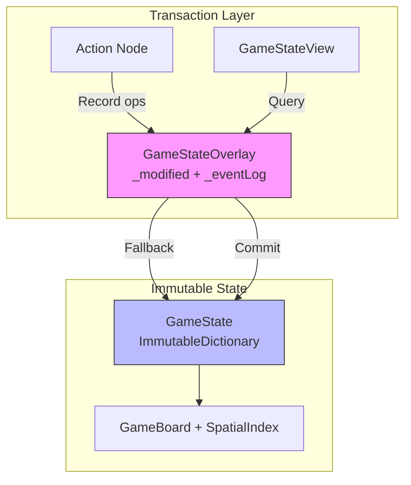

# GameState View & Overlay Implementation

## Overview
The **GameStateView** is the pattern used by actions and external systems to inspect the game state. It acts as a smart layer that unifies the committed (immutable) `GameState` with the pending modifications (mutable) in the `GameStateOverlay`.

## Why is this needed?
When a action executes multiple steps (e.g., *Check Range* → *Calculate Damage* → *Apply Damage*), the intermediate steps are recorded in the Overlay but not yet committed to the State.
Without `GameStateView`, a subsequent step in the same transaction wouldn't "see" changes made by a previous step (like an entity moving or dying).

---

## GameStateOverlay (Copy-on-Write Pattern)

The overlay uses a **Copy-on-Write** approach for efficient state management:

### Internal Structure

```csharp
public sealed class GameStateOverlay
{
    private readonly GameState _baseState;           // Reference to original state
    private readonly List<IGameStateOperation> _eventLog = new();     // For UI animations
    private readonly Dictionary<EntityId, GameEntity> _modified = new(); // Cloned entities
    private readonly HashSet<EntityId> _destroyed = new();            // Destroyed entities
    private IGameBoard? _board;                      // Cloned board (lazy)
}
```

### Key Methods

| Method | Description |
|--------|-------------|
| `Record(op)` | Adds to event log, clones entity if first modification, applies op in-place |
| `TryGetEntity(id)` | Returns modified entity from `_modified` or signals destruction |
| `TryGetPosition(id)` | Returns position from cloned board's spatial index |
| `IsDestroyed(id)` | Checks if entity is marked for destruction |
| `GetEntitiesMovedTo(pos)` | Returns entities that moved to a position (spatial query) |
| `GetEvents()` | Returns the operation log for UI animations |
| `Commit()` | Builds new `GameState` using pre-cloned entities (efficient) |

### Copy-on-Write Flow

```
Record(MoveOperation):
  1. Add to _eventLog (for UI)
  2. Clone entity if not already in _modified
  3. Clone board if not already cloned
  4. Update spatial index in cloned board
```

### Supported Operations

- **`SpawnEntityOperation`** - Creates new entity at position
- **`MoveOperation`** - Updates entity position in spatial index
- **`DestroyOperation`** - Marks entity for removal

---

## GameStateView Resolution

The View follows a strictly ordered resolution strategy:

1. **Overlay (Pending)**: Checks if the entity exists or has been modified/destroyed in the current transaction.
2. **Base State (Committed)**: If no pending changes exist, it falls back to the official immutable state.

### Code Example

```csharp
public GameEntity GetEntity(EntityId id)
{
    // 1. Check Overlay for pending changes
    if (_overlay.TryGetEntity(id, out var overlayEntity, out var isDestroyed))
    {
        if (isDestroyed) throw new Exception("Entity destroyed");
        if (overlayEntity != null) return overlayEntity;
    }

    // 2. Fallback to base state
    return _gameState.Entities[id];
}
```

### Spatial Queries

```csharp
public IEnumerable<GameEntity> GetEntitiesAt(IBoardPosition position)
{
    // 1. Get from spatial index (base or cloned)
    // 2. Filter out entities that moved away (overlay)
    // 3. Include entities that moved HERE (overlay)
    // 4. Resolve EntityIds to GameEntities
}
```

---

## Usage Pattern

```csharp
// Creating overlay for a action
var overlay = new GameStateOverlay(baseState);

// Record operations (entities are cloned on first modification)
overlay.Record(new MoveOperation(pawnId, newPosition));
overlay.Record(new SpawnEntityOperation(newEntity));

// View sees uncommitted changes immediately
var view = new GameStateView(baseState, overlay);
var pos = view.GetPosition(pawnId);  // Returns new position!

// Commit when ready (efficient - uses pre-cloned entities)
var newState = overlay.Commit();

// Get events for UI animations
var events = overlay.GetEvents();
foreach (var op in events) { /* animate */ }
```

---

## Benefits

| Benefit | Description |
|---------|-------------|
| **Consistency** | Actions see a consistent world state midway through a transaction |
| **Isolation** | Main `GameState` remains pristine until `Commit()` is called |
| **Efficiency** | Copy-on-Write: entities are only cloned when first modified |
| **UI Events** | Full operation log preserved for animations via `GetEvents()` |
| **Spatial Queries** | `GetEntitiesAt()` considers both base and pending moves |

---

## Architecture Diagram


