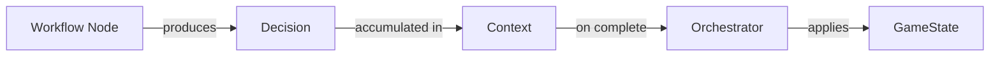

# Decision Types Reference

Complete catalog of all Decision types available in TurnForge Engine.

---

## Core Decision Interface

```csharp
public interface IDecision
{
    DecisionTiming Timing { get; }
    string OriginId { get; }
    GameState Apply(GameState state);
}
```

---

## Decision Timing

| Value | Description |
|-------|-------------|
| `Immediate` | Apply during workflow execution |
| `Deferred` | Apply at end of command/phase |
| `EndOfTurn` | Apply at turn end |

---

## Available Decision Types

### Spawn Decisions

| Decision | Purpose | Produced By |
|----------|---------|-------------|
| `SpawnDecision<T>` | Spawn any entity from descriptor | `SpawnWorkflow` |
| `AgentSpawnDecision` | Spawn agent specifically | Legacy spawn strategy |
| `PropSpawnDecision` | Spawn prop specifically | Legacy spawn strategy |

**Usage:**
```csharp
var decision = new SpawnDecision<AgentDescriptor>(descriptor);
context.RecordDecision(decision);
```

---

### Board Decisions

| Decision | Purpose | Produced By |
|----------|---------|-------------|
| `InitializeBoardDecision` | Set the game board | `InitializeBoardCommand` |

**Usage:**
```csharp
var decision = new InitializeBoardDecision(board);
context.RecordDecision(decision);
```

---

### Action Decisions

| Decision | Purpose | Produced By |
|----------|---------|-------------|
| `ActionDecision` | Update entity components after action | Action workflows |

**Usage:**
```csharp
var decision = new ActionDecisionBuilder(targetId)
    .WithComponent(new HealthComponent(newValue))
    .Build();
```

---

## Creating Custom Decisions

For game-specific decisions:

```csharp
public class DamageDecision : IDecision
{
    public DecisionTiming Timing => DecisionTiming.Immediate;
    public string OriginId => "Game.Damage";
    
    public EntityId Target { get; }
    public int Amount { get; }
    
    public DamageDecision(EntityId target, int amount)
    {
        Target = target;
        Amount = amount;
    }
    
    public GameState Apply(GameState state)
    {
        var agent = state.GetAgent(Target);
        if (agent == null) return state;
        
        var health = agent.GetComponent<HealthComponent>();
        var newHealth = health with { Current = health.Current - Amount };
        var newAgent = agent.ReplaceComponent(newHealth);
        
        return state.ReplaceAgent(newAgent);
    }
}
```

---

## Decision Flow



Decisions are **accumulated** during workflow execution and **applied atomically** only when the workflow completes successfully.
