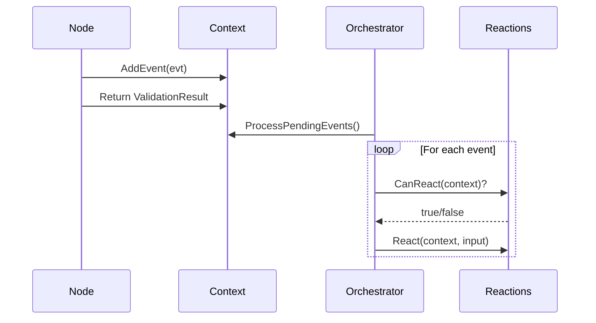

# Event Types Reference

Complete catalog of Events in TurnForge Engine.

---

## Event Categories

### 1. Game Events (Classic)
Produced by **Appliers** after state changes. Used for UI updates and logging.

### 2. Workflow Events
Produced by **Nodes** during workflow execution. Used to trigger **Reactions**.

---

## Game Events (IGameEvent)

| Event | Trigger | Data |
|-------|---------|------|
| `EntitySpawnedEvent` | Entity created | `EntityId`, `Type` |
| `AgentSpawnedEvent` | Agent spawned | `EntityId`, `Position` |
| `PropSpawnedEvent` | Prop spawned | `EntityId`, `Position` |
| `BoardInitializedEvent` | Board set up | `Width`, `Height` |
| `BoardCreatedEvent` | Board created | `GameBoard` |
| `ComponentsUpdatedEvent` | Components changed | `EntityId`, `Components` |

**Example:**
```csharp
// These are emitted automatically by Appliers
// UI listens to these for animations
public void OnEvent(AgentSpawnedEvent evt)
{
    SpawnAnimation(evt.EntityId, evt.Position);
}
```

---

## Workflow Events (IWorkflowEvent)

Workflow events are **game-specific**. The engine provides the interface:

```csharp
public interface IWorkflowEvent { }
```

### Common Patterns

| Event Pattern | When to Emit | Reaction Example |
|---------------|--------------|------------------|
| `MovedToEvent` | After position update | Trap damage |
| `AttackResolvedEvent` | After attack hit/miss | Counterattack |
| `TurnStartedEvent` | Turn phase begins | Regeneration |
| `TurnEndedEvent` | Turn phase ends | Poison damage |
| `ItemPickedUpEvent` | Item collected | Inventory full check |

**Creating Custom Events:**
```csharp
public record MovedToEvent(EntityId Agent, Position NewPosition) : IWorkflowEvent;

public record AttackResolvedEvent(
    EntityId Attacker, 
    EntityId Target, 
    bool Hit, 
    int Damage) : IWorkflowEvent;
```

**Emitting from Node:**
```csharp
public ValidationResult Validate(WorkflowContext context)
{
    // Do work...
    
    // Emit event for reactions
    context.AddEvent(new MovedToEvent(agentId, targetPosition));
    
    return ValidationResult.OkResult;
}
```

---

## Event → Reaction Flow



---

## Best Practices

1. **Name events past-tense** - `MovedTo`, `AttackResolved`, not `Moving`, `Attack`
2. **Include all context** - The reaction shouldn't need to query for basic info
3. **Keep immutable** - Use records, not classes
4. **One event per action** - Don't combine unrelated changes
