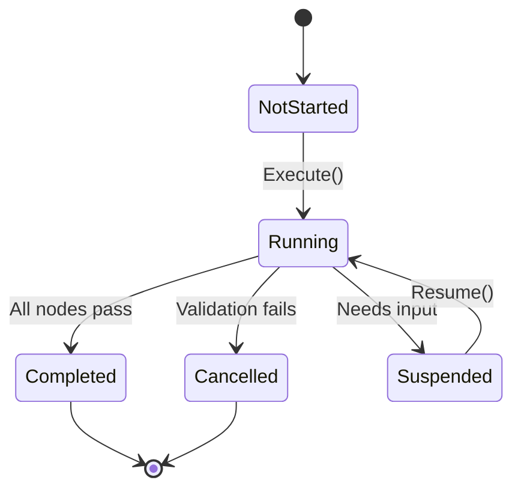

# Workflow Catalog

Standard workflows provided by TurnForge Engine.

---

## Engine Workflows

### SpawnWorkflow

**Purpose:** Spawn agents from spawn requests.

**Pipeline:**
```
SpawnValidationNode → SpawnProcessingNode → SpawnPlacementNode → SpawnDecisionNode
```

**Context Type:** `SpawnWorkflowContext`

| Node | Responsibility |
|------|----------------|
| `SpawnValidationNode` | Validate requests exist, catalog available |
| `SpawnProcessingNode` | Convert requests to descriptors using definitions |
| `SpawnPlacementNode` | Position assignment (extensible via reactions) |
| `SpawnDecisionNode` | Produce `SpawnDecision` for each descriptor |

**Usage:**
```csharp
var workflow = new SpawnWorkflow();
var context = new SpawnWorkflowContext(requests, catalog);
var result = orchestrator.Execute(workflow, context);
```

---

## Creating Custom Workflows

### 1. Define Context

```csharp
public class MoveWorkflowContext : WorkflowContext
{
    public EntityId AgentId { get; }
    public Position Origin { get; }
    public Position Target { get; }
    public int Cost { get; set; }
    
    public MoveWorkflowContext(EntityId agent, Position origin, Position target)
    {
        AgentId = agent;
        Origin = origin;
        Target = target;
    }
}
```

### 2. Create Nodes

```csharp
public class MoveValidationNode : INode
{
    public NodeId Id { get; } = new("Move.Validation");
    public INode? NextNode { get; set; }
    
    public ValidationResult Validate(WorkflowContext context)
    {
        if (context is not MoveWorkflowContext moveCtx)
            return ValidationResult.CancelResult;
            
        // Check bounds, obstacles, etc.
        var state = context.GetProjectedState();
        if (!state.Board.IsValidPosition(moveCtx.Target))
            return ValidationResult.CancelResult;
            
        return ValidationResult.OkResult;
    }
}
```

### 3. Assemble Workflow

```csharp
public class MoveWorkflow : IWorkflow
{
    public WorkflowId Id { get; } = new("Game.Move");
    public INode StartNode { get; }
    public IReadOnlyCollection<IReaction> GlobalReactions { get; }
    
    private readonly Dictionary<string, INode> _nodes = new();
    
    public MoveWorkflow()
    {
        var validation = new MoveValidationNode();
        var cost = new MoveCostNode();
        var execution = new MoveExecutionNode();
        
        validation.NextNode = cost;
        cost.NextNode = execution;
        
        StartNode = validation;
        GlobalReactions = new List<IReaction>
        {
            new TrapReaction(),
            new CrowdCostReaction()
        };
        
        RegisterNodes(validation, cost, execution);
    }
    
    public INode GetNode(NodeId id) => _nodes[id.Value];
    
    private void RegisterNodes(params INode[] nodes)
    {
        foreach (var n in nodes)
            _nodes[n.Id.Value] = n;
    }
}
```

---

## Workflow Patterns

| Pattern | When to Use |
|---------|-------------|
| **Linear** | Simple action (Spawn, BasicAttack) |
| **Branching** | Conditional paths (hit/miss) |
| **Looping** | Multi-step (movement path) |
| **Nested** | Complex composition (attack → damage → death → loot) |

---

## Workflow Lifecycle


