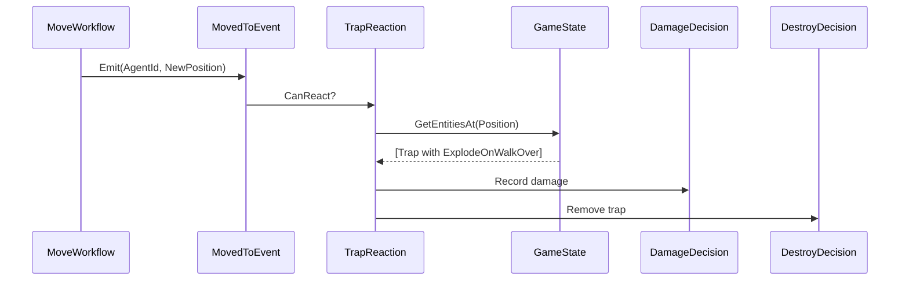

# Developer Guide: Traits and Reactions

This guide explains how to connect **Traits** (entity behaviors) with **Reactions** (game rules) in the TurnForge Workflow Engine.

---

## Conceptual Model

```
Trait (Data)          →  "What can this entity do?"
Event (Signal)        →  "What just happened?"
Reaction (Rule)       →  "What happens because of it?"
Decision (Intent)     →  "What should change?"
```

### Flow Example: Trap Explodes When Stepped On



---

## Step-by-Step Guide

### 1. Define the Trait

Traits are **markers** on entity definitions. They describe capabilities or behaviors.

```csharp
// In your game project (e.g., BarelyAlive.Rules)
public class ExplodeOnWalkOverTrait : IBaseTrait
{
    public int Damage { get; init; } = 5;
}
```

### 2. Attach Trait to Definition

When creating entity definitions (from JSON or code):

```csharp
var trapDefinition = new BaseGameEntityDefinition("Trap.Spike", "Hazard")
    .AddTrait(new ExplodeOnWalkOverTrait { Damage = 10 });

catalog.RegisterDefinition(trapDefinition);
```

### 3. Define the Event

Events signal **what happened** during workflow execution.

```csharp
public record MovedToEvent(EntityId AgentId, Position NewPosition) : IWorkflowEvent;
```

### 4. Emit Event from Workflow Node

Nodes emit events via the context:

```csharp
public class MoveExecutionNode : INode, IProducesDecisions
{
    public ValidationResult Validate(WorkflowContext context)
    {
        // Record the move decision
        var agentId = context.Get<EntityId>("AgentId");
        var target = context.Get<Position>("Target");
        
        context.RecordDecision(new UpdatePositionDecision(agentId, target));
        
        // Emit event for reactions
        context.AddEvent(new MovedToEvent(agentId, target));
        
        return ValidationResult.OkResult;
    }
}
```

### 5. Create the Reaction

Reactions **respond to events** by checking context and producing decisions.

```csharp
public class TrapReaction : IReaction
{
    public ReactionId Id { get; } = new("BarelyAlive.TrapReaction");

    public bool CanReact(WorkflowContext context)
    {
        // Check if there's a MovedToEvent we care about
        var movedEvents = context.PendingEvents.OfType<MovedToEvent>();
        if (!movedEvents.Any()) return false;

        // Check if any target position has a trap
        var state = context.GetProjectedState();
        foreach (var evt in movedEvents)
        {
            var entitiesAtPosition = state.GetEntitiesAt(evt.NewPosition);
            if (entitiesAtPosition.Any(e => HasTrait<ExplodeOnWalkOverTrait>(e)))
            {
                return true;
            }
        }
        return false;
    }

    public ReactionResult React(WorkflowContext context, IInputActionResult? input)
    {
        var state = context.GetProjectedState();
        var movedEvents = context.PendingEvents.OfType<MovedToEvent>();

        foreach (var evt in movedEvents)
        {
            var traps = state.GetEntitiesAt(evt.NewPosition)
                .Where(e => HasTrait<ExplodeOnWalkOverTrait>(e));

            foreach (var trap in traps)
            {
                var trait = GetTrait<ExplodeOnWalkOverTrait>(trap);
                
                // Record damage decision
                context.RecordDecision(new DamageDecision(evt.AgentId, trait.Damage));
                
                // Remove the trap
                context.RecordDecision(new DestroyEntityDecision(trap.Id));
            }
        }

        return ReactionResult.Continue();
    }
    
    // Helper: check if entity has trait (via its definition)
    private bool HasTrait<T>(GameEntity entity) where T : IBaseTrait
        => entity.Definition?.HasTrait<T>() ?? false;
    
    private T? GetTrait<T>(GameEntity entity) where T : IBaseTrait
        => entity.Definition?.GetTrait<T>();
}
```

### 6. Register Reaction with Workflow

When creating your game-specific workflow:

```csharp
public class MoveWorkflow : IWorkflow
{
    public WorkflowId Id { get; } = new("BarelyAlive.Move");
    public INode StartNode { get; }
    public IReadOnlyCollection<IReaction> GlobalReactions { get; }

    public MoveWorkflow()
    {
        // ... setup nodes ...
        
        GlobalReactions = new List<IReaction>
        {
            new TrapReaction(),
            new DarkZoneReaction(),
            new CrowdCostReaction()
        };
    }
}
```

---

## Key Points

| Concept | Lives In | Responsibility |
|---------|----------|----------------|
| **Trait** | Definition (Engine) | Describes entity capability |
| **Event** | Game Project | Signals what happened |
| **Reaction** | Game Project | Implements game rules |
| **Decision** | Engine/Game | Expresses state change intent |

### Best Practices

1. **Traits are pure data** - No logic, just properties
2. **Events are immutable** - Record what happened, don't mutate
3. **Reactions query, don't assume** - Always check projected state
4. **One reaction per rule** - Keep reactions focused and testable
5. **Use projected state** - See pending decisions before commit

### Engine vs Game Responsibilities

| Engine Provides | Game Implements |
|-----------------|-----------------|
| `IBaseTrait` interface | Specific traits (`ExplodeOnWalkOver`) |
| `IWorkflowEvent` marker | Specific events (`MovedToEvent`) |
| `IReaction` interface | Specific reactions (`TrapReaction`) |
| `WorkflowContext.GetProjectedState()` | Entity queries |
| `WorkflowOrchestrator` execution | Workflow definitions |

---

## Testing Reactions

```csharp
[Test]
public void TrapReaction_ShouldDamage_WhenSteppingOnTrap()
{
    // Arrange
    var reaction = new TrapReaction();
    var context = new TestWorkflowContext();
    
    // Setup projected state with trap at (5,5)
    var trap = CreateTrapWithExplodeTrait(position: new Position(5, 5));
    context.SetupProjectedState(state => state.AddProp(trap));
    
    // Add event
    context.AddEvent(new MovedToEvent(agentId, new Position(5, 5)));

    // Act
    Assert.That(reaction.CanReact(context), Is.True);
    var result = reaction.React(context, null);

    // Assert
    Assert.That(context.Decisions, Has.Some.TypeOf<DamageDecision>());
    Assert.That(context.Decisions, Has.Some.TypeOf<DestroyEntityDecision>());
}
```
