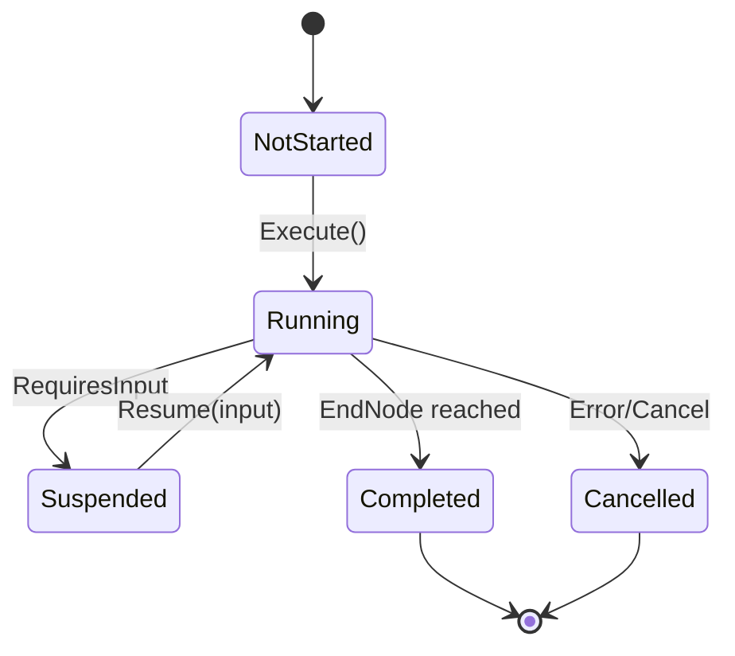

# Workflow Engine

The **Workflow Engine** is the core execution model for game logic in TurnForge. It replaces the legacy Command/Handler pattern with a more flexible, suspendable, and composable architecture.

---

## Architecture Overview

```
User Action → FSM Node → WorkflowOrchestrator → Nodes + Reactions → Decisions → Atomic Commit
```

### Key Components

| Component | Responsibility |
|-----------|----------------|
| `IWorkflow` | Defines structure (Nodes) and rules (Reactions) |
| `INode` | Single execution step (validation, calculation, etc.) |
| `IReaction` | Rule that responds to events/context changes |
| `WorkflowContext` | Mutable execution state (decisions, events, navigation) |
| `WorkflowOrchestrator` | Executes workflows, handles suspension/resumption |

---

## Workflow Lifecycle



### Status Values
- **NotStarted**: Workflow created but not executed
- **Running**: Actively processing nodes
- **Suspended**: Waiting for external input
- **Completed**: Successfully finished, decisions ready for commit
- **Cancelled**: Aborted due to error or explicit cancellation

---

## Core Interfaces

### IWorkflow

```csharp
public interface IWorkflow
{
    WorkflowId Id { get; }
    INode StartNode { get; }
    IReadOnlyList<IReaction> GlobalReactions { get; }
}
```

### INode

```csharp
public interface INode
{
    NodeId Id { get; }
    INode? NextNode { get; }
    NodeExecutionResult Execute(WorkflowContext context);
}
```

### IReaction

```csharp
public interface IReaction
{
    ReactionId Id { get; }
    bool CanReact(WorkflowContext context);
    ReactionResult React(WorkflowContext context);
}
```

---

## Creating a Workflow

### Step 1: Define Nodes

```csharp
public class ValidationNode : INode
{
    public NodeId Id { get; } = new("Validation");
    public INode? NextNode { get; set; }

    public NodeExecutionResult Execute(WorkflowContext context)
    {
        var agentId = context.Get<EntityId>("AgentId");
        var target = context.Get<Position>("Target");

        // Validation logic
        if (!IsValidMove(agentId, target))
            return NodeExecutionResult.Cancel("Invalid move");

        return NodeExecutionResult.Continue();
    }
}
```

### Step 2: Define Workflow

```csharp
public class MoveWorkflow : IWorkflow
{
    public WorkflowId Id { get; } = new("Move");
    public INode StartNode { get; }
    public IReadOnlyList<IReaction> GlobalReactions { get; }

    public MoveWorkflow()
    {
        var validation = new ValidationNode();
        var cost = new CostCalculationNode();
        var execution = new MoveExecutionNode();

        validation.NextNode = cost;
        cost.NextNode = execution;

        StartNode = validation;
        GlobalReactions = new List<IReaction>
        {
            new TrapReaction(),
            new DarkZoneReaction()
        };
    }
}
```

### Step 3: Execute via Orchestrator

```csharp
var orchestrator = new WorkflowOrchestrator();
var context = new MoveWorkflowContext();
context.Set("AgentId", agentId);
context.Set("Target", targetPosition);

var result = orchestrator.Execute(workflow, context);

if (result.Status == WorkflowStatus.Completed)
{
    // Apply decisions atomically
    foreach (var decision in context.Decisions)
    {
        orchestrator.Apply(decision);
    }
}
```

---

## Reactions

Reactions are rules that respond to workflow events or context changes.

### Reaction Result Types

```csharp
public static class ReactionResult
{
    // Continue execution
    public static ReactionResult Continue();

    // Modify input and continue
    public static ReactionResult WithModifiedInput(IInputActionResult input);

    // Launch nested workflow
    public static ReactionResult WithNestedWorkflow(IWorkflow nested, bool executeNow = true);

    // Suspend and wait for input
    public static ReactionResult RequiresInput(WorkflowContext context);
}
```

### Example: Trap Reaction

```csharp
public class TrapReaction : IReaction
{
    public ReactionId Id { get; } = new("TrapReaction");

    public bool CanReact(WorkflowContext context)
    {
        // React when entering a tile with a trap
        return context.TryGet<TileEnteredEvent>("CurrentEvent", out var evt)
            && HasTrap(evt.TileId);
    }

    public ReactionResult React(WorkflowContext context)
    {
        var evt = context.Get<TileEnteredEvent>("CurrentEvent");
        
        // Record damage decision
        context.RecordDecision(new DamageDecision(
            context.Get<EntityId>("AgentId"),
            trapDamage
        ));

        return ReactionResult.Continue();
    }
}
```

---

## Suspension & Resumption

Workflows can suspend execution when external input is required (e.g., dice roll, target selection).

### Suspending

```csharp
public class DiceRollNode : INode
{
    public NodeExecutionResult Execute(WorkflowContext context)
    {
        // Request dice roll from UI
        return NodeExecutionResult.RequiresInput<DiceRollResult>("Roll dice to continue");
    }
}
```

### Resuming

```csharp
// From GameEngineRuntime
var inputCommand = new WorkflowInputCommand(diceResult);
var result = runtime.ExecuteCommand(inputCommand);
```

---

## Integration with FSM

The FSM can launch workflows via `NodeExecutionResult.LaunchWorkflow()`:

```csharp
public class CombatFsmNode : LeafNode
{
    public override NodeExecutionResult Execute(GameState state)
    {
        var workflow = new AttackWorkflow(attackerId, targetId);
        var context = new AttackWorkflowContext();

        return NodeExecutionResult.LaunchWorkflow(workflow, context);
    }
}
```

The `GameEngineRuntime` intercepts workflow requests and manages:
1. Workflow execution via `IWorkflowOrchestrator`
2. Suspension handling (returns control to UI)
3. Atomic commit of decisions on completion

---

## Decisions & Events

### Recording Decisions

```csharp
// In any Node or Reaction
context.RecordDecision(new MoveDecision(agentId, newPosition));
context.RecordDecision(new ResourceDecision(agentId, "AP", -1));
```

### Emitting Events

```csharp
// Nodes that implement IProducesDecisions
public class MoveExecutionNode : INode, IProducesDecisions
{
    public IEnumerable<IWorkflowEvent> GetEvents(WorkflowContext context)
    {
        yield return new TileEnteredEvent(context.Get<Position>("Target"));
    }
}
```

---

## Projected State

During workflow execution, nodes can query the *projected* state (base state + pending decisions):

```csharp
// Configure projection
context.ConfigureProjection(
    () => repository.LoadGameState(),
    new ProjectionService()
);

// In a node
var projectedState = context.GetProjectedState();
var agent = projectedState.GetAgent(agentId);
// Agent reflects all pending decisions
```

---

## Best Practices

1. **Keep Nodes Small**: Each node should do one thing
2. **Use Reactions for Rules**: Game rules belong in Reactions, not Nodes
3. **Prefer Events over Inline Logic**: Emit events, let Reactions handle them
4. **Test Workflows Independently**: Mock `WorkflowContext` for unit tests
5. **Atomic Commit**: Never apply decisions mid-workflow

---

## Migration from Commands

| Legacy (Command) | New (Workflow) |
|------------------|----------------|
| `ICommandHandler` | `IWorkflow` + `INode` |
| `CommandResult.WithDecisions()` | `context.RecordDecision()` |
| Inline Strategy logic | `IReaction` |
| Immediate Applier | Atomic commit on completion |

See [workflow_migration_analysis.md](file:///Users/barrufex/Development/TurnForge/memorybank/requirements/workflow_migration_analysis.md) for detailed migration examples.
