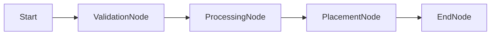
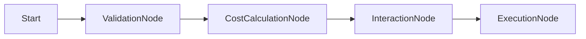

# Analysis: Migrating Spawn & Move to Workflow Engine

## 1. Context & Objective
We are transitioning from a **Command/Handler/Strategy** pattern to the **Workflow Engine** pattern.
- **Current State**: Monolithic Strategies (`BarelyAliveMovementStrategy`) handle validation, cost calculation, side effects (DarkZone), and decision creation.
- **Target State**: Linear Workflows of **Nodes** (Structure) with decoupled **Reactions** (Rules) and **Decisions** (Persistence).

## 2. "Spawn" Command Migration

### Current Implementation
`SpawnAgentsCommandHandler` acts as a pipeline:
1. **Preprocessor**: Converts `SpawnRequest` -> `AgentDescriptor`.
2. **Strategy**: Filters/Modifies descriptors (Black box logic).
3. **Output**: Generates `SpawnDecision`s.

### Proposed Workflow: `SpawnWorkflow`

This workflow focuses on **pure data transformation** and **placement validation**.

#### Workflow Structure


| Node | Responsibility | Example Reactions (Game Rules) |
|------|----------------|--------------------------------|
| **ValidationNode** | Check global limits (max units). | `GameLimitReaction`: "Max 50 zombies allowed." |
| **ProcessingNode** | Data transformation (modifiers). | `NecromancerBoostReaction`: "Add 'Frenzied' trait to all spawned Zombies."<br>`DifficultyScalerReaction`: "If Turn > 10, upgrade to Runners." |
| **PlacementNode** | Resolve final positions (if dynamic). | `SpawnBlockerReaction`: "If target tile occupied, find nearest empty." |
| **EndNode** | Produce Decisions. | *None (System only)* |

#### Key Change
Instead of a monolithic `Process()` method in strategy, rules like "Buff Zombies" are independent **Reactions** that subscribe to the `ProcessingNode`.

---

## 3. "Move" Command Migration

### Current Implementation
`MoveCommandHandler` + `BarelyAliveMovementStrategy`:
- **Validation**: Bounds, Blockers.
- **Cost Logic**: hardcoded `baseCost + zombiesAtPosition`.
- **Side Effects**: `DarkZoneMoveStrategy` has hardcoded "Roll Dice" logic inside the movement loop.

### Proposed Workflow: `MoveWorkflow`

This workflow decouples **Movement Mechanics** (A to B) from **Interventions** (Traps, Costs).

#### Workflow Structure


| Node | Responsibility | Events Emitted | Example Reactions (Game Rules) |
|------|----------------|----------------|--------------------------------|
| **ValidationNode** | Can agent move? | *None* | `RootedStatusReaction`: "Cancel if agent has Rooted status." |
| **CostNode** | Calculate AP cost. | `MovementCostEvent` | **`ZombicideGrabReaction`**: "On `MovementCostEvent`, if Survivor, add +1 Cost per local enemy." |
| **InteractionNode** | Simulate traversal. | `TileEnteringEvent` | **`DarkZoneReaction`**: "On `TileEnteringEvent`, if tile is DarkZone, request Dice Roll."<br>`TrapReaction`: "On `TileEnteringEvent`, if tile has Trap, add DamageDecision." |
| **ExecutionNode** | Finalize. | *None* | *Produces `MoveDecision` and `ResourceDecision` (AP).* |

### Deep Dive: Zombicide "Grab" Logic
**Old Way**:
```csharp
// Inside Strategy
int cost = 1;
if (agent.IsSurvivor) {
   cost += CountZombies(agent.Position);
}
```

**New Way (Reaction)**:
- **Reaction**: `ZombicideCrowdReaction`
- **Hook**: `OnReact(CostNode)`
- **Trigger**: `MovementCostEvent`
- **Logic**:
  1. Inspect Event (contains context info).
  2. Query map for Zombies at Origin.
  3. `context.Cost += count`.
- **Benefit**: The `MoveWorkflow` doesn't know about Zombies. It just knows it emits a cost event.

### Deep Dive: Dark Zone / Trap Logic
**Old Way**:
```csharp
// Inside Strategy
if (IsDarkZone(target)) {
   var result = inputService.RequestRoll(...); // Blocks execution!
   if (result < 4) ApplyDamage();
}
```

**New Way (Workflow)**:
1. `InteractionNode` starts.
2. Emits `TileEnteringEvent(TargetPos)`.
3. `DarkZoneReaction` activates (sees Event + DarkZone on Tile).
4. Reaction returns `ReactionResult.WithNestedWorkflow(DiceRollWorkflow)` OR requests Input.
5. Engine pauses, gets Input (Roll 3).
6. Reaction resumes, sees "3".
7. Reaction adds `DamageDecision` to Context.
8. Workflow continues to `ExecutionNode`.
9. **Result**: Agent moves AND takes damage.

---

## 4. Unified "Action Workflow" (Future Vision)

Both Spawn and Move could eventually inherit from a generic `ActionWorkflow` if they share enough "Cost" or "Validation" structure. For now, keeping them distinct is safer, but they share the **Workflow Engine** infrastructure.

## 5. Migration Strategy

1. **Define Contexts**: Create `MoveWorkflowContext` (AgentId, Origin, Target, Cost) and `SpawnWorkflowContext` (Requests, Descriptors).
2. **Implement Structural Nodes**: `ValidationNode`, `CostNode`, etc. (Generic where possible).
3. **Port Logic to Reactions**:
   - Extract "Grab" logic to `CrowdCostReaction`.
   - Extract "Validation" logic to `GridBoundariesReaction`.
4. **Update Handlers**: The CommandHandlers will simply bootstrap the Orchestrator with the correct Workflow.

## 6. Recommendations

- **Start with MoveWorkflow**: It has the most complex logic (Costs, Traps, Input) and proves the value of the engine.
- **Keep Spawn Simple**: Spawn is mostly data processing. It fits the pattern but doesn't stress-test it like Move does.
